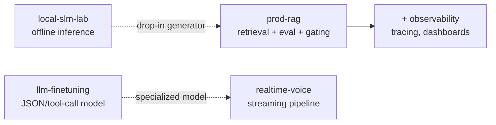

# AI Engineering Portfolio

> I build AI systems that are **reliable, measurable, and production-ready** — not demos.

Four repositories, each self-contained, that together cover the core competencies of a
production AI engineer: retrieval, evaluation, observability, local/offline inference,
model training, and real-time systems.

| # | Repo | What it demonstrates | Status |
|---|------|----------------------|--------|
| 1 + 3 | [`prod-rag`](https://github.com/mimuruth/prod-rag) | Production RAG (hybrid retrieval, reranking, citation enforcement) **+** full observability, cost/latency tracking, and CI regression gating | Phases 1–3 complete |
| 2 | [`local-slm-lab`](https://github.com/mimuruth/local-slm-lab) | Offline small-language-model benchmarking, schema-constrained outputs, model comparison study | Implemented |
| 4 | [`llm-finetuning`](https://github.com/mimuruth/llm-finetuning) | LoRA/QLoRA SFT + DPO preference tuning with before/after metrics | Implemented |
| 5 | [`realtime-voice`](https://github.com/mimuruth/realtime-voice) | Real-time ASR → LLM → TTS pipeline with a latency budget and graceful degradation | Implemented |

## The story these tell

- **`local-slm-lab`** produces a benchmarked local model that can serve as a drop-in generator for **`prod-rag`**.
- **`llm-finetuning`** produces a JSON-extraction / tool-calling model usable inside **`realtime-voice`**.

## Build order (recommended)

1. `prod-rag` `v0.1 → v1.0` (Projects 1 then 3) — the highest-signal, most common enterprise pattern.
2. `local-slm-lab` — quick win, fully offline, no API keys.
3. `realtime-voice` — highest "wow" factor for live demos.
4. `llm-finetuning` — most infra-heavy (GPU), do last.

---

Each repo has its own README with an architecture diagram, a results table with **real numbers**, and setup instructions.
