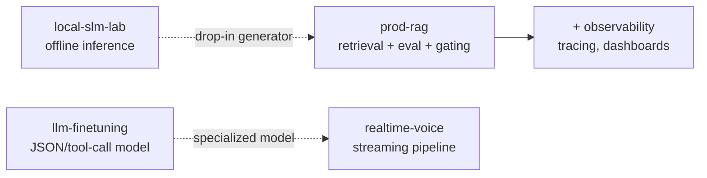

# AI Engineering Portfolio

> I build AI systems that are **reliable, measurable, and production-ready** — not demos.

Four repositories, each self-contained, that together cover the core competencies of a
production AI engineer: retrieval, evaluation, observability, local/offline inference,
model training, and real-time systems.

> 📘 **[AI Engineering Textbook](book/)** — a ~70-page,
> textbook-style guide that teaches the concepts, walks through every project with
> real measured numbers, and doubles as an interview-prep guide. Build the PDF from
> the Markdown source in [`book/`](book/) with `npm run build`.
>
> 📄 **One-page executive summary** — [PDF](book/ai-engineering-onepager.pdf) ·
> [PNG](book/ai-engineering-onepager.png) (for a résumé attachment or LinkedIn).
>
> ▶️ **90-second walkthrough** — _Loom demo coming soon._
> <!-- When recorded, replace the line above with:
> ▶️ **[90-second walkthrough](PASTE_LOOM_URL_HERE)** — a quick tour of all five projects. -->

| # | Repo | What it demonstrates | Status |
|---|------|----------------------|--------|
| 1 + 3 | [`prod-rag`](https://github.com/mimuruth/prod-rag) | Production RAG (hybrid retrieval, reranking, citation enforcement) **+** full observability, cost/latency tracking, and CI regression gating | Phases 1–3 complete |
| 2 | [`local-slm-lab`](https://github.com/mimuruth/local-slm-lab) | Offline small-language-model benchmarking, schema-constrained outputs, model comparison study | Implemented |
| 4 | [`llm-finetuning`](https://github.com/mimuruth/llm-finetuning) | LoRA/QLoRA SFT + DPO preference tuning with before/after metrics | Implemented |
| 5 | [`realtime-voice`](https://github.com/mimuruth/realtime-voice) | Real-time ASR → LLM → TTS pipeline with a latency budget and graceful degradation | Implemented |

## Results at a glance

Real, measured numbers — each repo's README has the full write-up and charts.

| Repo | Headline metrics |
|------|------------------|
| [`prod-rag`](https://github.com/mimuruth/prod-rag) | faithfulness **0.87** · answer-relevancy **0.85** · context-precision **1.00** (CI-gated) · p50 **2.3 s** · **$0.00025**/req · **100%** citation coverage · **0%** failure · [🔗 live](https://prod-rag.lemonstone-a5ab9349.eastus.azurecontainerapps.io/healthz) |
| [`local-slm-lab`](https://github.com/mimuruth/local-slm-lab) | **89.6 tok/s** (llama3.2 3B) · cold start **2.6–8.4 s** across 3B–7B · temp 0 **fully deterministic** · plain JSON **0/5** → Instructor **valid** |
| [`realtime-voice`](https://github.com/mimuruth/realtime-voice) | per-stage p50 — ASR **61.8 ms** · LLM **93.0 ms** · TTS **46.9 ms** · **~202 ms** end-to-end · graceful degradation + replay |
| [`llm-finetuning`](https://github.com/mimuruth/llm-finetuning) | 4-bit QLoRA on RTX 5070 (8 GB) · SFT: JSON validity **0.00→0.67** · refusal **0.67→1.00** · exact-match **0.00→0.33** · DPO reward margin **+6.9** |

## The story these tell

- **`local-slm-lab`** produces a benchmarked local model that can serve as a drop-in generator for **`prod-rag`**.
- **`llm-finetuning`** produces a JSON-extraction / tool-calling model usable inside **`realtime-voice`**.

## Build order (recommended)

1. `prod-rag` `v0.1 → v1.0` (Projects 1 then 3) — the highest-signal, most common enterprise pattern.
2. `local-slm-lab` — quick win, fully offline, no API keys.
3. `realtime-voice` — highest "wow" factor for live demos.
4. `llm-finetuning` — most infra-heavy (GPU), do last.

---

Each repo has its own README with an architecture diagram, a results table with **real numbers**, and setup instructions.
