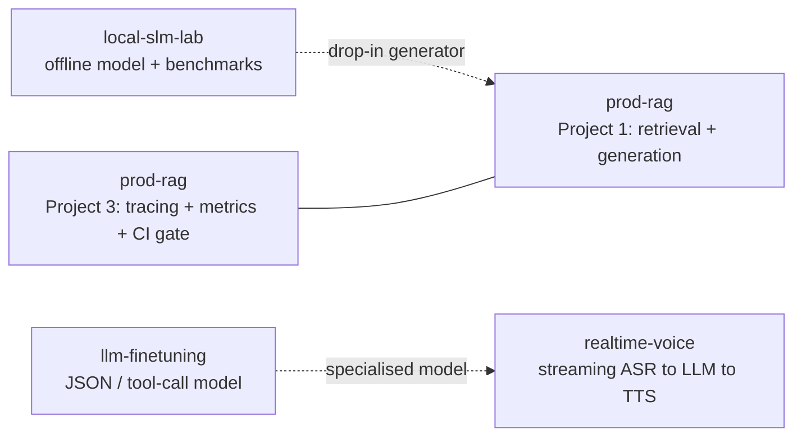

# Preface

## Who this book is for

This book is written for someone who is comfortable with basic programming and
the command line, but who is **new to most of the ideas in modern AI
engineering**: retrieval-augmented generation, embeddings, evaluation, tracing,
fine-tuning, and real-time streaming systems. You do not need a machine-learning
background. Every concept is introduced from first principles before any code
appears.

It is also a **portfolio and interview guide**. The five projects it teaches are
real, they live in public GitHub repositories, and — wherever a laptop can run
the code — they carry *real, measured numbers* rather than illustrative ones.
The final chapters show you how to present that work to a hiring manager.

## The three ways to read it

1. **As a textbook.** Read front to back. Chapters 1–3 build the shared
   foundation (how language models, retrieval, and reproducible engineering
   work). Chapters 4–8 each teach one project. Chapters 9–13 cover the
   cross-cutting disciplines — testing, deployment, portfolio polish, and
   interview preparation.
2. **As an implementation guide.** Each project chapter is a complete, runnable
   walkthrough: prerequisites, setup, configuration, commands, expected output,
   tests, evaluation, benchmarks, and troubleshooting. Nothing is left as
   pseudocode where a laptop can run the real thing.
3. **As a reference.** The table of contents and the per-chapter *References*
   sections point at the authoritative documentation and papers behind every
   decision.

## A note on honesty of numbers

A portfolio built on invented benchmarks is worse than no portfolio: it fails
the first technical question. This book is scrupulous about labelling evidence.
Throughout, you will see one of these tags:

> **MEASURED** — a number produced by running the code on the hardware described
> in Chapter 2.
> **EXAMPLE** — representative output shown to illustrate shape/format, not a
> benchmark.
> **REQUIRES YOU** — a step that needs hardware, a paid API key, or a manual
> action only the repository owner can perform. The exact instructions are
> given, but the number is not yet collected.

Never present an **EXAMPLE** or a **REQUIRES YOU** target as a **MEASURED**
result. That single discipline is what separates an engineer from a
demo-builder.

## The five projects and the four repositories

The five projects map onto **four repositories**, because Projects 1 and 3 share
one codebase by design (you cannot instrument a pipeline you have not built).

| # | Project | Repository | Why |
|---|---------|-----------|-----|
| 1 | Production-grade RAG | `prod-rag` | The core retrieval + generation system. |
| 3 | Monitoring & observability | `prod-rag` | Observability *instruments Project 1's exact pipeline* — same code, added tracing/metrics/CI gates. Splitting them would mean maintaining a fake pipeline to observe. |
| 2 | Offline local SLM | `local-slm-lab` | Fully offline; no shared code with RAG, so it stands alone. |
| 4 | Fine-tuning (LoRA/QLoRA/DPO) | `llm-finetuning` | GPU training pipeline; independent lifecycle. |
| 5 | Real-time multimodal (voice) | `realtime-voice` | Streaming architecture; independent lifecycle. |

The relationships between them are deliberate and worth stating in an interview:

- `local-slm-lab` produces a **benchmarked local model** that can serve as a
  drop-in generator inside `prod-rag` when privacy or cost rules out an API.
- `llm-finetuning` produces a **specialised JSON/tool-calling model** that is
  exactly the kind of component a `realtime-voice` assistant needs for fast,
  structured turns.
- `prod-rag` is where Projects 1 and 3 meet: retrieval quality (1) is only
  trustworthy because observability and CI gates (3) keep it from silently
  regressing.

Everything in this book — the code, the diagrams, the numbers, and this PDF's
build pipeline — is reproducible from the repositories. Let us begin with the
ideas the whole field rests on.
