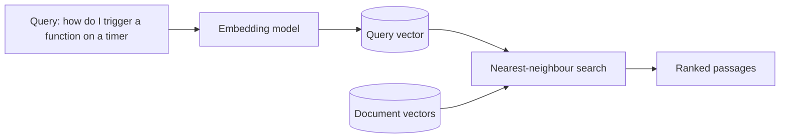

# Chapter 1 — Foundations of Modern AI Engineering

Before building anything, we need a shared vocabulary. This chapter explains the
handful of ideas that every later chapter assumes. Read it even if you have
skimmed these words before, because the *engineering* meaning of each one — what
it costs, where it breaks — is what matters here.

## 1.1 What a large language model actually is

A **large language model (LLM)** is a function that, given a sequence of text,
predicts the probability distribution of the next chunk of text. That is the
whole trick. Everything else — answering questions, writing code, holding a
conversation — is that one operation applied repeatedly.

- **What it is:** a very large neural network (billions of parameters) trained on
  a very large text corpus to predict the next token.
- **Why it exists:** next-token prediction turns out to be a general-purpose
  objective. To predict the next word of a well-written explanation, the model
  must internalise grammar, facts, reasoning patterns, and style.
- **What problem it solves:** it replaces thousands of narrow, hand-built NLP
  systems (summarisers, classifiers, extractors) with one system you *program in
  natural language* via prompts.
- **How it works internally:** the network is a **transformer** (Section 1.3).
  It converts text into vectors, mixes information across positions with an
  *attention* mechanism, and emits a probability for every possible next token.
- **Where it fits:** the LLM is the "reasoning" box in every project in this
  book. In RAG it writes the grounded answer; in the voice assistant it turns a
  transcript into a reply; in fine-tuning it *is* the artefact we improve.

### Tokens: the unit of everything

Models do not see characters or words; they see **tokens** — sub-word pieces
produced by a *tokenizer*. "Observability" might be three tokens; a rare word
might be five. Two consequences drive real engineering decisions:

1. **You are billed and rate-limited per token**, split into *input* (prompt)
   and *output* (generation) tokens, usually at different prices. Cost control
   is token control.
2. **The context window is measured in tokens**, not words (Section 1.4).

> **Interview framing.** "Why did you track input and output tokens separately?"
> Because they are priced differently and they tell different stories: input
> tokens measure how much context you are stuffing into the prompt (a retrieval
> problem), output tokens measure how verbose the model is (a prompt-design
> problem). In `prod-rag` we record both per request and turn them into a cost
> estimate — Chapter 5.

## 1.2 Embeddings and vector space

An **embedding** is a list of numbers (a vector, often 384–3072 dimensions) that
represents the *meaning* of a piece of text, such that texts with similar
meaning have vectors that are close together.

- **What it is:** a learned map from text to a point in high-dimensional space.
- **Why it exists:** computers cannot compare meaning directly, but they can
  compare vectors with simple arithmetic (cosine similarity).
- **What problem it solves:** "find me the passages most relevant to this
  question" becomes "find the stored vectors nearest to the question's vector."
- **How it works internally:** an embedding model (a cousin of the LLM) reads
  text and pools its internal representation into one vector. Training pushes
  paraphrases together and unrelated texts apart.
- **Where it fits:** embeddings are the heart of the *vector retrieval* half of
  RAG (Chapter 4). They are also how you can visualise a corpus (Section 1.2).
- **Industry use cases:** semantic search, deduplication, clustering,
  recommendation, retrieval for RAG.
- **Alternatives:** keyword search (BM25) compares *words*, not meaning; it wins
  on exact terms (error codes, product names) and loses on paraphrase. This is
  precisely why `prod-rag` uses **both** and fuses them (hybrid retrieval).

> **Mental model.** Picture every passage as a star in a galaxy. The query is a
> new star; retrieval is "which existing stars are nearest?" Cosine similarity is
> the angle between two stars as seen from the origin — small angle, similar
> meaning.

## 1.3 Transformers and attention (just enough)

You can build every project here treating the transformer as a black box, but
one idea — **attention** — explains the model's strengths and its cost curve.

- **The problem before transformers:** older models (RNNs) read text strictly
  left to right, so information from far back faded.
- **Attention's answer:** for each token, compute how much it should "attend to"
  every other token, and blend their representations accordingly. Every position
  can look at every other position in one step.
- **The cost:** attention is **quadratic** in sequence length — doubling the
  context roughly quadruples the compute for that layer. That is *why* context
  windows are finite and why stuffing more text into a prompt is not free
  (Section 1.4).

You do not need the maths to ship these projects, but the quadratic cost is the
reason Chapter 4 spends effort on *chunking* and *context-window management*
instead of "just send the whole document."

## 1.4 Context windows and why chunking exists

The **context window** is the maximum number of tokens a model can consider at
once (input + output). Modern models range from a few thousand to hundreds of
thousands of tokens.

Two hard truths shape RAG:

1. **Corpora are bigger than any context window.** You cannot paste a 400-page
   manual into a prompt.
2. **More context is not always better.** Models exhibit a "lost in the middle"
   effect — relevant facts buried in a long context are used less reliably than
   the same facts placed near the top.

The engineering response is **chunking**: split documents into passages of a few
hundred tokens, retrieve only the most relevant handful, and place them
carefully in the prompt. Chapter 4 documents the exact chunk sizes tested in
`prod-rag` (500–800 tokens, ~100-token overlap) and the results.

## 1.5 Sampling and temperature

When the model has a probability distribution over next tokens, **sampling**
decides which token to actually emit. **Temperature** rescales that distribution:

- **Temperature 0** — always take the most likely token. Deterministic;
  reproducible; the right choice for extraction, classification, and tool calls.
- **Higher temperature (e.g. 0.7)** — flatten the distribution so less likely
  tokens get a chance. More varied and "creative"; the right choice for
  brainstorming; dangerous for structured output.

Chapter 6 (`local-slm-lab`) contains a **measured** temperature study: at
temperature 0 the model produced **1 distinct output across 5 runs** for every
prompt (fully deterministic); at 0.7 it produced **4–5 distinct outputs of 5**.
That is not a vibe — it is a table you can point to.

## 1.6 The three ways to make a model do your task

There is a hierarchy of effort. Reach for the cheapest one that works.

| Technique | What you change | Cost | When to use |
|-----------|-----------------|------|-------------|
| **Prompting** | The input text only | Minutes | Almost always try first. |
| **Retrieval (RAG)** | Add *facts* to the prompt at runtime | Hours–days | The model lacks *knowledge* (your docs, fresh data). |
| **Fine-tuning** | The model's *weights* | Days + GPU | The model lacks a *skill/format* even when given the facts. |

- **RAG changes what the model *knows*** for one request without retraining. Use
  it for private or fast-changing knowledge.
- **Fine-tuning changes what the model *is*.** Use it when you need a consistent
  behaviour or output format that prompting cannot reliably enforce — exactly the
  case Chapter 7 (`llm-finetuning`) targets with structured JSON extraction.

> **The classic interview trap.** "Would you fine-tune to add company knowledge?"
> Usually **no** — knowledge that changes should live in a retrieval index (RAG),
> not baked into weights you would have to retrain. Fine-tune for *skill and
> format*, retrieve for *facts*.

## 1.7 Evaluation: the discipline that makes it engineering

Anyone can get one good answer from an LLM. The engineering question is: *how do
you know it is good, and how do you keep it good as you change things?* That is
**evaluation**, and it splits into two kinds you must not confuse:

- **Offline evaluation** — run the system over a fixed *golden dataset* of
  questions with known-good answers, and score it. Reproducible; used as a **CI
  gate** so a pull request that lowers quality fails the build (Chapters 4–5).
- **Online/operational monitoring** — watch *real* traffic in production:
  latency percentiles, cost, error rates, citation coverage (Chapter 5).

Key metrics you will meet:

- **Retrieval:** Precision@K, Recall@K, Mean Reciprocal Rank (MRR).
- **Generation:** faithfulness (is the answer supported by the retrieved text?),
  answer relevancy, context precision.
- **Operations:** p50/p90/p95/p99 latency, cost per request, failure rate.

> **Why percentiles, never averages.** One 12-second request hidden behind a
> hundred fast ones vanishes in a mean but is exactly the user who churns. p90
> ("90% of requests were at least this fast") surfaces the tail. Chapter 5 shows
> the **measured** p50 = 2326 ms and p90 = 3709 ms from `prod-rag`.

## 1.8 Real-time systems: a different world

The first four projects are *request/response*: ask, wait, receive. Project 5
(`realtime-voice`) is **streaming**, and streaming breaks assumptions:

- Data arrives continuously (audio frames), not in one blob.
- Every stage has a **latency budget** measured in tens of milliseconds; the sum
  is the user's perceived delay before they hear a reply.
- Dependencies *will* fail mid-stream, so you need **timeouts, fallbacks, and
  graceful degradation** rather than a single try/except.

Chapter 8 defines the streaming vocabulary (backpressure, load shedding, circuit
breakers, replay). For now, hold onto the core idea: in a real-time system,
**being late is the same as being wrong.**

## 1.9 How the rest of the book is organised

- **Chapter 2** — the reproducible environment: hardware, Python, Ollama,
  Docker, and the exact versions behind every measured number.
- **Chapter 3** — Git/GitHub workflow and repository security.
- **Chapter 4** — `prod-rag`, Project 1: retrieval + generation.
- **Chapter 5** — `prod-rag`, Project 3: observability + CI gating (same code).
- **Chapter 6** — `local-slm-lab`, Project 2: offline models + benchmarks.
- **Chapter 7** — `llm-finetuning`, Project 4: LoRA / QLoRA / DPO.
- **Chapter 8** — `realtime-voice`, Project 5: streaming ASR → LLM → TTS.
- **Chapters 9–13** — testing, deployment, portfolio readiness, interview
  preparation, and the bibliography.

### References

- Vaswani et al., "Attention Is All You Need" (2017) — the transformer.
- Lewis et al., "Retrieval-Augmented Generation for Knowledge-Intensive NLP
  Tasks" (2020) — the RAG paper.
- Liu et al., "Lost in the Middle: How Language Models Use Long Contexts" (2023).
- Hugging Face, "LLM Course" and OpenAI, "Tokenizer" documentation.
