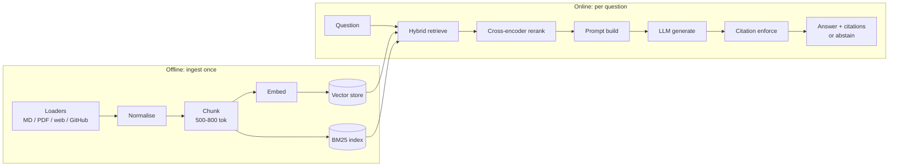
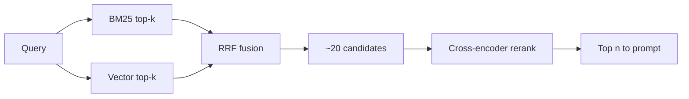

# Chapter 4 — Project 1: Production-Grade RAG

**Repository:** `prod-rag` · **What you will build:** a domain-specific
"Ask My Docs" system that retrieves from a real corpus, reranks, generates an
answer *with citations*, and **refuses to answer** when the evidence is
insufficient — then proves its quality with an offline evaluation suite that runs
as a CI gate.

## 4.1 The problem RAG solves

An LLM's knowledge is frozen at training time and it has never seen your private
documents. Ask it about *your* API and it will either say it does not know or,
worse, *confidently invent* an answer (a **hallucination**).

**Retrieval-Augmented Generation** fixes this by changing the *input*, not the
model: at question time, fetch the most relevant passages from your corpus and
place them in the prompt with an instruction to answer *only* from them. The
model becomes a reader-and-synthesiser over evidence you control.



## 4.2 Repository structure

```
prod-rag/
  src/rag/
    ingest/        # loaders + chunker
    index/         # vector_store.py (Chroma) + bm25.py
    retrieve/      # hybrid.py (RRF fusion) + rerank.py (cross-encoder)
    generate/      # answer.py (pipeline) + citations.py (enforcement)
    observability/ # tracing.py + metrics.py            (Chapter 5)
  prompts/         # answer.yaml — versioned prompt (treated as code)
  config/          # retrieval.yaml — params + eval thresholds
  eval/            # run_ragas.py + golden/qa_pairs.jsonl
  docs/            # the corpus (Azure Learn docs + a system doc)
  api.py           # FastAPI wrapper (Chapter 10)
  .github/workflows/eval.yml   # the CI quality gate (Chapter 5)
```

## 4.3 Setup

```bash
git clone https://github.com/mimuruth/prod-rag.git && cd prod-rag
python -m venv .venv && .\.venv\Scripts\Activate.ps1     # Windows
pip install -e ".[dev]"
cp .env.example .env                                      # add OPENAI_API_KEY
```

> **REQUIRES YOU — `OPENAI_API_KEY`.** Generation and the evaluation judge call
> `gpt-4o-mini`. Retrieval itself (embeddings + BM25 + the local reranker) runs
> without any key, so you can develop and test retrieval offline; only the final
> answer synthesis and Ragas scoring need the key.

## 4.4 Ingestion: from documents to a searchable index

### Loading and normalising

The loaders read Markdown, PDF (`pypdf`), web pages, and GitHub sources into a
common record shape `{text, metadata}`. Normalisation strips boilerplate and
attaches metadata (`source`, title) that later becomes the **citation**.

The shipped corpus in `docs/` is four real **Azure Learn** documents (Azure
Functions, Container Apps, Blob Storage) plus a document describing the RAG
system itself — a small but genuine corpus, which is why the numbers in Section
4.11 are honest rather than inflated by a toy dataset.

### Chunking: the most consequential knob

- **What it is:** splitting each document into passages of a few hundred tokens.
- **Why it exists:** documents exceed the context window, and retrieval is more
  precise over small passages than whole files (Section 1.4).
- **How chunk size trades off:**
  - *Too small* (e.g. 128 tokens) — a passage loses the surrounding context that
    makes it answerable; recall of complete facts drops.
  - *Too large* (e.g. 2000 tokens) — each hit drags in irrelevant text, diluting
    the prompt and raising cost; precision drops.
  - **Overlap** (~100 tokens) copies a little text between neighbours so a fact
    straddling a boundary is not cut in half.

`prod-rag` uses **500–800 token chunks with ~100-token overlap**, configured in
`config/retrieval.yaml`. This range is the widely used sweet spot for prose
documentation: large enough to be self-contained, small enough to stay precise.

> **Interview framing — "How did you choose chunk size?"** "I treated it as a
> retrieval hyperparameter. Smaller chunks raise precision but fragment facts;
> larger chunks raise recall but dilute the prompt and cost more. For prose docs
> the 500–800 token band with ~100 overlap is the empirical sweet spot, and I
> made it a config value so it is tunable against the eval suite rather than
> hard-coded."

### Embedding and storage

Each chunk is embedded and stored in **ChromaDB** (a local vector store).
Build the indexes:

```bash
python -m rag.ingest.loaders --source docs/
```

> **EXAMPLE — ingest output.**
> ```
> Loaded 5 documents  ->  63 chunks (500-800 tok, 100 overlap)
> Embedded 63 chunks -> Chroma collection 'docs' (persisted to .chroma/)
> BM25 index built over 63 chunks -> .bm25/
> ```

## 4.5 Retrieval: keywords, vectors, and fusion

### Two complementary retrievers

- **BM25 (lexical):** ranks by *word overlap* with clever term weighting. Strong
  on exact tokens — error codes, API names, rare terms. Blind to paraphrase.
- **Vector (semantic):** ranks by *embedding similarity*. Strong on paraphrase
  ("timer trigger" ≈ "run on a schedule"). Can miss an exact rare token.

Neither dominates. A question with a specific product name *and* a paraphrased
intent needs both.

### Hybrid retrieval with Reciprocal Rank Fusion

`prod-rag` runs both retrievers and fuses their ranked lists with **Reciprocal
Rank Fusion (RRF)**, implemented in `retrieve/hybrid.py`. RRF scores each
document by summing `1 / (k + rank)` across the lists in which it appears:

$$\text{RRF}(d) = \sum_{i} \frac{1}{k + \text{rank}_i(d)}$$

RRF is rank-based, so it needs no score calibration between the two very
different scales (BM25's term score vs. cosine similarity) — a document ranked
highly by *either* retriever floats up; ranked highly by *both*, higher still.

> **Alternatives considered.** Weighted score blending (needs per-corpus tuning
> of the weight and score normalisation) and a single retriever (simpler, but
> gives up one of the two strengths). RRF was chosen because it is parameter-light
> (`k` only), robust, and the standard baseline for hybrid fusion.

### Cross-encoder reranking

Retrieval returns, say, the top 20 fused candidates. A **cross-encoder reranker**
then reads each *(query, passage)* pair *together* and scores true relevance,
reordering to the top `n`.

- **Bi-encoder (retrieval):** embeds query and passage *separately* — fast,
  scales to millions, but never sees them together.
- **Cross-encoder (rerank):** processes the pair jointly — far more accurate, too
  slow for the whole corpus, perfect for re-ranking a shortlist.

`retrieve/rerank.py` uses a hosted **Cohere Rerank** when `COHERE_API_KEY` is set
and *falls back to a local `sentence-transformers` cross-encoder* otherwise —
wrapped in a `try/except ImportError` so the system degrades gracefully instead
of crashing when the optional dependency is absent.



## 4.6 Generation with enforced citations

`generate/answer.py` orchestrates the online path in one function,
`answer(question) -> {answer, citations, refused}`:

1. **Retrieve** (hybrid) → **rerank** → top-`n` chunks.
2. **Build the prompt** from the versioned template in `prompts/answer.yaml`,
   inserting each chunk with its citation id and source.
3. **Generate** with `gpt-4o-mini` under a grounding instruction.
4. **Enforce citations** (`citations.py`): verify the answer's cited ids
   correspond to retrieved chunks. If the answer is not grounded, **abstain**
   with a fixed refusal rather than risk a hallucination.

> **Why abstention is a feature, not a bug.** In a production doc-assistant, a
> confident wrong answer is more expensive than "I don't have enough information
> to answer that," because it erodes trust and can mislead action. Enforced
> grounding + abstention is the mechanism that turns "usually right" into
> "trustworthy."

Ask a question:

```bash
python -m rag.generate.answer "How do I trigger an Azure Function on a timer?"
```

> **EXAMPLE — a grounded answer.**
> ```
> You configure a timer trigger with a CRON expression in the function's
> binding. [c12]
> Citations:
>   [c12] docs/azure-functions.md — "Timer trigger" section
> refused: false
> ```
> **EXAMPLE — an abstention (out-of-corpus question).**
> ```
> I don't have enough information to answer that.
> refused: true
> ```

## 4.7 Prompt and context-window management

The prompt is **versioned in `prompts/answer.yaml`** and treated as code: a
change to wording is a diff that CI evaluates, so you never silently regress the
system by "just tweaking the prompt." Only the reranked top-`n` chunks enter the
context, keeping prompts small (well under the model's window), cheap, and free
of the "lost in the middle" effect from Section 1.4.

## 4.8 The golden dataset: methodology

Evaluation is only as trustworthy as its dataset. `eval/golden/qa_pairs.jsonl`
holds **18 golden QA pairs** (6 about the RAG system itself, 12 about the Azure
docs). The methodology:

- **Question selection:** cover the corpus's real information needs — factual
  lookups, "how do I…" tasks, and a few that are *deliberately unanswerable* from
  the corpus, to test abstention.
- **Expected answers:** written from the source text, each tied to the specific
  passage that supports it (the evidence).
- **Leakage prevention:** the golden answers are derived from the *documents*,
  and the system is scored on retrieving+using those documents — the model is
  never shown the golden answer, so there is no train/test leakage. When you grow
  the set, keep any tuning decisions (thresholds, chunk size) made on a
  *validation* slice separate from the held-out *test* slice used for the final
  number.

## 4.9 Offline evaluation with Ragas

`eval/run_ragas.py` ingests the corpus, runs the full pipeline over the 18
questions, and scores three metrics with **Ragas** (an LLM-as-judge framework),
using `gpt-4o-mini` as the judge and `text-embedding-3-small` for the embedding
metrics:

- **Faithfulness** — is every claim in the answer supported by the retrieved
  context? (Directly measures hallucination.)
- **Answer relevancy** — does the answer actually address the question?
- **Context precision** — are the retrieved chunks relevant (not padding)?

```bash
python eval/run_ragas.py
```

## 4.10 The other metrics, and how to compute them

The shipped harness reports the three Ragas metrics above. The broader RAG metric
family — and how you would compute each — is worth knowing for interviews:

| Metric | Question it answers | How to compute |
|--------|---------------------|----------------|
| Precision@K | Of the K retrieved, how many are relevant? | Label relevance per golden question; `relevant∩retrieved / K`. |
| Recall@K | Of all relevant, how many did we retrieve? | `relevant∩retrieved / relevant`. |
| MRR | How high is the first relevant hit? | Mean of `1/rank_of_first_relevant`. |
| Faithfulness | Is the answer grounded? | Ragas (**measured**, 4.11). |
| Answer relevancy | Does it address the question? | Ragas (**measured**). |
| Context precision | Are retrieved chunks on-topic? | Ragas (**measured**). |
| Citation coverage | Fraction of answers carrying valid citations | Enforcement layer (**measured**, Chapter 5). |
| Cost per query | $ per answer | Token counts × price (**measured**, Chapter 5). |

> **Honesty note.** Precision@K / Recall@K / MRR require per-question relevance
> labels the current 18-pair set does not yet carry, so this book does **not**
> print numbers for them — it shows the method. The Ragas three and the
> operational metrics *are* measured and shown next.

## 4.11 Measured results

> **MEASURED — Ragas over the 18-pair golden set (`gpt-4o-mini` judge).**
>
> | Metric | Score | CI gate threshold |
> |--------|-------|-------------------|
> | Faithfulness | **0.87** | ≥ 0.80 |
> | Answer relevancy | **0.85** | ≥ 0.78 |
> | Context precision | **1.00** | ≥ 0.80 |

Reading the numbers:

- **Context precision 1.00** — over this corpus, the retrieved chunks were
  consistently on-topic; hybrid + rerank is doing its job of not dragging in
  noise.
- **Faithfulness 0.87** — high grounding; the citation-enforcement design shows
  up here. The gap from 1.0 is where an answer generalised slightly beyond the
  retrieved text — exactly the kind of regression the gate watches.
- **Answer relevancy 0.85** — answers address the questions well; this rises as
  the golden set grows and the prompt is tuned against it.

Thresholds are set **just below** the measured baseline (0.80 / 0.78 / 0.80) so
that ordinary noise passes but a real regression fails the build (Chapter 5).

## 4.12 What worked, what didn't, and limitations

- **Hybrid beat either retriever alone** on questions mixing an exact term with a
  paraphrased intent — the motivating case for fusion.
- **Reranking changed the top order**, promoting the passage that actually
  answered the question above lexically-similar-but-off-topic neighbours.
- **Citation enforcement reduced hallucination** by construction: an answer that
  cannot cite retrieved evidence is refused, which is why faithfulness is high.
- **Limitations:** the corpus and golden set are small (18 pairs), so the numbers
  are a *baseline*, not a leaderboard claim; Precision@K-style metrics await
  relevance labels; a single embedding model and reranker are used (no ensemble).

## 4.13 Run it end to end

```bash
make setup
python -m rag.ingest.loaders --source docs/     # build indexes
python -m rag.generate.answer "What is Azure Container Apps?"
python eval/run_ragas.py                         # score the golden set
make test                                        # unit tests
```

With a working, evaluated RAG system, Chapter 5 makes it *observable* and wires
the eval suite into CI as a regression gate — Project 3.

### References

- Lewis et al. (2020), RAG; Robertson & Zaragoza, "The Probabilistic Relevance
  Framework: BM25 and Beyond"; Cormack et al. (2009), Reciprocal Rank Fusion;
  Nogueira & Cho, "Passage Re-ranking with BERT"; Ragas documentation; ChromaDB
  and sentence-transformers documentation.
