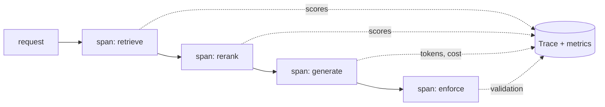

# Chapter 5 — Project 3: Monitoring and Observability

**Repository:** `prod-rag` (same codebase as Chapter 4) · **What you will build:**
end-to-end tracing, a metrics rollup with real latency/cost/quality numbers, and
a CI gate that fails a pull request when quality regresses.

## 5.1 Why Projects 1 and 3 share a repository

You cannot instrument a pipeline you have not built. Observability *is* the RAG
pipeline with tracing spans and metric records threaded through it. Splitting them
into two repositories would force you to maintain a fake pipeline to observe.
Instead, the git history tells the story: `v0.2` is Project 1 (the pipeline),
`v1.0` is Project 3 (the same pipeline, now observable and gated).

## 5.2 The vocabulary: logs, metrics, traces, and friends

These words are used loosely in the wild; precision matters in an interview.

| Term | What it is | Answers |
|------|-----------|---------|
| **Log** | A timestamped text/JSON line about one event | "What happened here?" |
| **Metric** | A number aggregated over time (counter, gauge, histogram) | "How much / how often / how fast overall?" |
| **Event** | A discrete, structured thing that occurred | "What just happened, with what fields?" |
| **Span** | A single timed operation with start/end + attributes | "How long did *this stage* take?" |
| **Trace** | A tree of spans for one request | "Where did the whole request spend its time?" |
| **Correlation ID** | A shared id linking all records of one request | "Show me everything for request X." |
| **Distributed tracing** | Traces that span multiple services | "Which service in the chain was slow?" |

- **Offline evaluation** (Chapter 4) scores a fixed golden set — reproducible,
  used as a gate.
- **Online/operational monitoring** watches live traffic — latency, cost, errors.
- **Quality monitoring** watches *answer quality* on live traffic (citation
  coverage, faithfulness sampling), not just system health.

## 5.3 Instrumenting every stage

`observability/tracing.py` wraps each pipeline stage in a span; the whole
`answer()` call is one trace. For each request, the system captures:

- **Query** and any query transformation.
- **Retrieved chunks**, their **retrieval scores**, and the **source** (BM25 vs.
  vector) they came from.
- **Reranker scores** and the **reranked order**.
- **Prompt template + version** and the **final prompt**.
- **Model name + configuration**, the **generated response**, and **citations**.
- **Input / output / total tokens** and the **cost** derived from them.
- **Per-stage latency** and **end-to-end latency**.
- **Errors, retries, fallbacks, and validation results** (e.g. did citation
  enforcement pass; did the reranker fall back to local).



## 5.4 Choosing a tracing platform

The candidates are **Langfuse**, **LangSmith**, and **Braintrust**. `prod-rag`
uses **Langfuse**.

| Platform | Model | Why it fits here |
|----------|-------|------------------|
| **Langfuse** | Open-source, **self-hostable** | Full control, no data leaves your box, free to run locally; strong tracing + cost tracking. **Chosen.** |
| LangSmith | Hosted (LangChain) | Excellent, but hosted-first and tied to the LangChain ecosystem, which this repo deliberately avoids. |
| Braintrust | Hosted eval-first | Great eval UX; hosted, and eval here is already covered by Ragas + CI. |

> **Interview framing.** "Why Langfuse?" "I wanted traces and cost/latency
> dashboards without shipping request data to a third party, so a self-hostable,
> open-source platform won. The tracing wrapper is defensive — it no-ops if
> `LANGFUSE_*` is unset — so the pipeline never depends on the tracer being up."

The wrapper targets the **Langfuse v3/v4 SDK** (`start_as_current_span`, token
usage folded into span metadata) and is a **full no-op when unconfigured**, so
tests and offline runs never require a running collector.

## 5.5 Standing up Langfuse locally

```bash
docker compose -f docker-compose.langfuse.yml up -d   # postgres + clickhouse + redis + minio + web + worker
# open http://localhost:3000, create a project, copy the keys into .env:
#   LANGFUSE_PUBLIC_KEY=pk-lf-...
#   LANGFUSE_SECRET_KEY=sk-lf-...
#   LANGFUSE_HOST=http://localhost:3000
python -m rag.generate.answer "What is Azure Container Apps?"   # traces now appear
```

> **REQUIRES YOU — live trace screenshots.** The trace timeline and dashboard
> screenshots for the portfolio are produced by running the stack above and
> asking a few questions. This is a manual step (Docker + a few queries); the
> code and compose file are ready.

## 5.6 The metrics rollup

Independently of Langfuse, every request appends a line to
`.metrics/requests.jsonl`, and `observability/metrics.py` rolls them up into
percentiles, cost, citation coverage, and failure rate:

```bash
python -m rag.observability.metrics
```

Cost is computed from token counts at `gpt-4o-mini` pricing
($0.15 / 1M input tokens, $0.60 / 1M output tokens).

## 5.7 Measured operational results

> **MEASURED — rollup over 8 grounded queries against the Azure-docs corpus.**
>
> | p50 latency | p90 latency | avg cost / request | citation coverage | failure rate |
> |-------------|-------------|--------------------|-------------------|--------------|
> | **2326 ms** | **3709 ms** | **$0.00025** | **100%** | **0%** |


*Figure 5.1 — Left: Ragas scores sit above their CI gate thresholds. Right:
measured p50/p90 latency. Cost per request is $0.00025 with 100% citation
coverage.*

Reading the numbers:

- **p50 2.3 s / p90 3.7 s** — the tail (p90) is ~1.6× the median, driven by
  generation time, not retrieval; retrieval and rerank are milliseconds against
  the LLM's seconds.
- **$0.00025 per request** — with `gpt-4o-mini` and tight, reranked context,
  answers cost a fraction of a cent.
- **100% citation coverage, 0% failure** — every answer over this set carried
  valid citations, and none errored — the enforcement design (Chapter 4) made
  visible as an operational metric.

> **ESTIMATE — cost at scale.** At $0.00025/request, 10,000 requests/day ≈
> **$2.50/day ≈ $75/month** in model spend (self-hosted retrieval and tracing add
> only infrastructure). Labelled an estimate because it extrapolates the measured
> per-request cost; real traffic mixes longer answers.

> **Note on p95/p99.** The same `requests.jsonl` supports p95/p99, but with n=8
> those percentiles are not statistically meaningful, so this book reports p50/p90
> and shows the method rather than printing noisy tail numbers. With production
> traffic you would add p95/p99 straight from the same rollup.

## 5.8 The dashboards to build

Once the stack has traffic, chart these (Langfuse provides most out of the box):

- Latency percentiles (p50/p90/p95/p99) over time.
- Cost per request and daily/monthly projections.
- Citation coverage, faithfulness (sampled), context relevance.
- Failure rate, unsupported-answer rate, empty-retrieval rate, retry rate, model
  timeout rate.

Each chart should carry a caption stating what it shows and why it matters — a
p90 spike is a user-experience story, not just a line.

## 5.9 A disciplined anomaly workflow

When a metric moves, follow the same loop every time (this is the *method*; the
example is illustrative, not a claimed incident):

1. **What happened** — which metric changed, by how much, starting when?
2. **Which trace exposed it** — open a slow/failed request's trace; find the span
   that grew.
3. **Suspected root cause** — e.g. p90 rose because the reranker fell back to the
   local cross-encoder after a Cohere timeout, adding CPU time.
4. **Corrective action** — add a timeout+retry to the hosted reranker, or pin the
   local model warm.
5. **Result after the fix** — re-measure the same metric; confirm the tail
   returned to baseline.

> **EXAMPLE — anomaly note format (template, not a measured event).**
> ```
> Metric:      p90 latency 3.7s -> 6.1s
> Trace:       req_9f2c — 'rerank' span 40ms -> 2.3s
> Cause:       Cohere rerank timeout -> local fallback on cold CPU model
> Action:      warm local reranker at startup; 1.5s timeout on hosted call
> Result:      p90 back to 3.8s
> ```

## 5.10 The CI regression gate

The offline eval suite (Chapter 4) runs on every pull request via
`.github/workflows/eval.yml`. It ingests the corpus, scores the golden set, and
**fails the build if any metric drops below its threshold** in
`config/retrieval.yaml` (faithfulness 0.80 / answer relevancy 0.78 / context
precision 0.80). A subtle but important detail: a `nan` score (e.g. the judge
failed) is treated as a **gate failure**, not a pass — "no signal" must never
sneak through as "green."

```yaml
# .github/workflows/eval.yml (essence)
name: rag-eval-gate
on: [pull_request]
jobs:
  eval:
    runs-on: ubuntu-latest
    steps:
      - uses: actions/checkout@v4
      - uses: actions/setup-python@v5
        with: { python-version: "3.11" }
      - run: pip install -e ".[dev]"
      - env: { OPENAI_API_KEY: ${{ secrets.OPENAI_API_KEY }} }
        run: python eval/run_ragas.py     # exits non-zero if below threshold
```

> **REQUIRES YOU — activate the gate.** Set the CI secret so the judge can run:
> `gh secret set OPENAI_API_KEY --repo mimuruth/prod-rag`. Until then the job
> *skips* (green-because-skipped); with it, the job *enforces*
> (green-because-passed) — a much stronger signal, and worth doing before you
> show the repo.

> **EXAMPLE — the gate passing vs. blocking a PR.**
> ```
> # passing
> faithfulness      0.87 >= 0.80  OK
> answer_relevancy  0.85 >= 0.78  OK
> context_precision 1.00 >= 0.80  OK
> eval gate: PASS
>
> # blocking (a prompt change regressed grounding)
> faithfulness      0.71 <  0.80  FAIL
> eval gate: FAIL  ->  pull request blocked by branch protection
> ```

This is the payoff of Chapters 3–5 together: a change that *looks* fine but
*measurably* lowers answer quality cannot reach `main`.

### References

- Langfuse, LangSmith, and Braintrust documentation; OpenTelemetry concepts
  (spans/traces); Google SRE Book (the "Four Golden Signals" and percentile
  monitoring); Ragas documentation.
