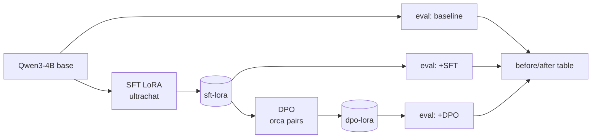

# Chapter 7 — Project 4: Fine-Tuning with LoRA, QLoRA, and DPO

**Repository:** `llm-finetuning` · **What you will build:** a parameter-efficient
fine-tuning pipeline that takes a base model, teaches it a *skill* (structured
JSON extraction) with LoRA, aligns it further with DPO, and reports before/after
metrics — runnable end-to-end on a GPU with **one command**.

> **REQUIRES YOU — a CUDA GPU.** This is the one project this book cannot run on
> the reference laptop. Everything is implemented and the run is a single script
> (Section 7.9); the before/after numbers are the book's one **REQUIRES YOU**
> result set, awaiting a GPU box (a few dollars on a rented instance).

## 7.1 The training vocabulary

- **Pretraining** — the original, enormous next-token training that produces a
  *base* model. You will not do this; it costs millions.
- **Instruction tuning / Supervised Fine-Tuning (SFT)** — continue training on
  *(prompt, ideal response)* pairs so the model follows instructions in a format.
- **Parameter-Efficient Fine-Tuning (PEFT)** — train a *tiny* number of new
  parameters instead of all billions. LoRA is the dominant method.
- **LoRA (Low-Rank Adaptation)** — freeze the base weights; inject small
  low-rank matrices (adapters) into each layer and train only those. The update
  is `W + BA` where `B` and `A` are low-rank, so you train megabytes, not
  gigabytes.
- **QLoRA** — LoRA on top of a **4-bit quantized** base model, so a model that
  would need ~32 GB in full precision trains in ~16 GB. This is what makes a 4B
  model tunable on a single consumer GPU.
- **Adapters** — the small trained LoRA weights; portable, stackable, swappable
  without touching the base model.
- **Preference data** — triples of *(prompt, chosen, rejected)* responses that
  express which answer is better.
- **Direct Preference Optimization (DPO)** — train directly on preference triples
  to make *chosen* more likely and *rejected* less, **without a separate reward
  model** (the simpler successor to RLHF).
- **Reward modelling / RLHF** — the older two-stage alignment (train a reward
  model, then RL against it); DPO collapses this into one stable step.
- **Alignment** — shaping *behaviour* (helpfulness, refusal, format) rather than
  adding knowledge.
- **Catastrophic forgetting** — over-training on a narrow task erodes general
  ability. PEFT + modest epochs mitigate it.
- **Overfitting** — memorising the training set; caught by a held-out validation
  split.
- **Evaluation leakage** — test examples (or near-duplicates) leaking into
  training, inflating scores. Prevented by deduplicating across splits.

## 7.2 Choosing a measurable task

Fine-tune for a **skill or format**, not for facts (Section 1.6). The task here
is **structured JSON extraction from messy text** (with tool-call selection and
correct refusal as siblings), because success is *objectively measurable*:

- **JSON validity rate** — does the output parse?
- **Schema compliance / field-level accuracy** — are the right fields present and
  correct?
- **Exact-match accuracy** — does the object equal the gold object?
- **Refusal correctness** — does it refuse when it should?

Contrast with "make it a better writer," which has no crisp metric. A fine-tuning
project lives or dies on whether you can *score* it.

## 7.3 The dataset pipeline

`data/prepare.py` builds two datasets:

- **SFT** from `HuggingFaceH4/ultrachat_200k` (instruction-following chat).
- **DPO** from `argilla/distilabel-intel-orca-dpo-pairs` (preference triples).

The full pipeline you should apply (and that the code scaffolds):

1. **Source selection + licensing** — prefer permissively licensed datasets;
   record the license.
2. **Inspection → filtering → deduplication** — remove malformed, too-long, or
   duplicate rows; dedup *across* splits to prevent leakage.
3. **Normalisation + schema validation** — enforce the target output schema on
   training targets so you never train on invalid gold.
4. **Splits** — train / validation / test, disjoint.
5. **Edge cases + refusal examples** — include inputs that *should* be refused, so
   the model learns to abstain.
6. **Preference pairs** — for DPO, construct *(prompt, chosen, rejected)* where
   `chosen` is valid/correct and `rejected` is a plausible-but-wrong output.

```bash
python data/prepare.py --task both --limit 2000
```

> **Why a task-specific set even when general sets exist.** General instruction
> data teaches broad following; it will not make the model reliably emit *your*
> JSON schema or refuse *your* out-of-scope inputs. General data is the
> foundation; a small, high-quality task set is what moves the target metric.
> *Quality ≫ quantity* — 2k excellent examples beat 200k noisy ones.

## 7.4 TRL vs. Axolotl

| Tool | Style | Use when |
|------|-------|----------|
| **Hugging Face TRL** | Python scripts (`SFTTrainer`, `DPOTrainer`) | You want explicit control and to read exactly what runs. **Primary here.** |
| **Axolotl** | One declarative YAML config | You want a fast, batteries-included run and are happy to configure via YAML. **Provided as the alternative** (`configs/sft.yml`, `configs/dpo.yml`). |

The repo ships **both**: TRL scripts (`scripts/train_sft.py`,
`scripts/train_dpo.py`, `scripts/eval.py`) for control, and Axolotl configs for a
one-file run.

## 7.5 Configuration and hyperparameters

Base model: **`Qwen/Qwen3-4B`**. The knobs that matter, and how to think about
them:

| Hyperparameter | Typical | What it controls |
|----------------|---------|------------------|
| Quantization | 4-bit (QLoRA) | Base-model memory during training |
| LoRA rank `r` | 8–32 | Capacity of the adapter (bigger = more to learn, more to overfit) |
| LoRA alpha | 16–64 | Scaling of the adapter update (often `2×r`) |
| LoRA dropout | 0.05 | Regularisation on the adapter |
| Batch size | small | Limited by VRAM |
| Gradient accumulation | 4–16 | Simulates a larger batch without more VRAM |
| Learning rate | 1e-4–2e-4 | Step size (higher than full fine-tuning) |
| Epochs | 1–3 | Too many → overfitting / forgetting |

Training is **stackable**: base → SFT adapter → DPO adapter *on top of* the SFT
adapter.



## 7.6 Training commands

```bash
# TRL path
python scripts/train_sft.py --base-model Qwen/Qwen3-4B          # -> artifacts/sft-lora
python scripts/train_dpo.py --base-model Qwen/Qwen3-4B --adapter artifacts/sft-lora  # -> artifacts/dpo-lora

# Axolotl alternative
accelerate launch -m axolotl.cli.train configs/sft.yml
accelerate launch -m axolotl.cli.train configs/dpo.yml
```

Record **training curves** (loss over steps) with your experiment tracker; a
healthy SFT run shows loss falling then plateauing. Checkpointing lets you resume
an interrupted run.

## 7.7 Evaluation: base vs. SFT vs. SFT+DPO

`scripts/eval.py` loads the base model with an optional adapter and scores it with
`eval/metrics.py` (`json_validity_rate`, `exact_match_rate`,
`refusal_correctness`) over a held-out extraction set (`data/test_extraction.jsonl`):

```bash
python scripts/eval.py --model Qwen/Qwen3-4B                       # baseline
python scripts/eval.py --model Qwen/Qwen3-4B --adapter artifacts/sft-lora
python scripts/eval.py --model Qwen/Qwen3-4B --adapter artifacts/dpo-lora
```

> **REQUIRES YOU — the before/after table.** Run the script above on a GPU and
> fill this in. The shape is fixed; the numbers are collected by *you*:
>
> | Metric | Base | + SFT | + DPO |
> |--------|------|-------|-------|
> | JSON validity rate | — | — | — |
> | Exact-match accuracy | — | — | — |
> | Refusal correctness | — | — | — |
>
> This book will **not** print invented numbers here. Everything up to the GPU
> boundary is implemented and runnable.

### What to expect and watch for (interview-ready)

- **SFT should raise JSON validity and exact-match** most — it directly teaches
  the format.
- **DPO should add incremental gains** on the softer preferences (cleaner
  refusals, fewer hallucinated fields). If DPO does *not* help, that is a valid,
  honest finding — it usually means the preference pairs were not discriminative
  enough, and the fix is better pairs, not more epochs.
- **Watch for:** invalid outputs (schema too strict, or LR too high destabilised
  the model), overfitting (train loss down, val metrics flat), and leakage
  (suspiciously perfect exact-match → check dedup across splits).

## 7.8 Deciding QLoRA vs. full fine-tuning

> **Interview framing — "Why QLoRA, not full fine-tuning?"** "Full fine-tuning a
> 4B model needs many tens of GB of VRAM and produces a full-size checkpoint per
> experiment. QLoRA trains 4-bit base + small adapters in ~16 GB and yields a
> few-MB adapter I can version and swap. For a single-task skill, LoRA reaches
> comparable quality at a fraction of the cost — the pragmatic default."

## 7.9 One command on a GPU box

```bash
pip install torch --index-url https://download.pytorch.org/whl/cu121   # match your CUDA
bash scripts/run_all.sh
```

`run_all.sh` chains the whole pipeline: install → baseline eval → data prep → SFT
→ eval → DPO → eval, printing the metrics you paste into Section 7.7. Adapters are
pushed to the Hugging Face Hub (they are git-ignored), keeping the repo lean.

### References

- Hu et al. (2021), "LoRA"; Dettmers et al. (2023), "QLoRA"; Rafailov et al.
  (2023), "Direct Preference Optimization"; Hugging Face TRL and PEFT
  documentation; Axolotl documentation; Qwen3 model card.
