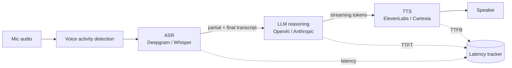

# Chapter 8 — Project 5: Real-Time Multimodal (Voice)

**Repository:** `realtime-voice` · **What you will build:** a streaming
**ASR → LLM → TTS** voice assistant with a per-stage **latency budget**, timeouts
and fallbacks, a **replay mode** for deterministic debugging, and failure
injection — measured end-to-end.

## 8.1 Batch vs. streaming: a different world

Projects 1–4 are request/response: send input, wait, get output. A voice
assistant is **streaming** — audio arrives continuously and the user is *waiting
to hear a reply*, so every millisecond of every stage is on the critical path.

The streaming vocabulary you must know:

| Term | Meaning |
|------|---------|
| **Streaming data** | Continuous input (audio frames), processed as it arrives |
| **Event-driven** | Components react to events rather than polling |
| **WebSockets** | Full-duplex, persistent connection — used to orchestrate the pipeline |
| **Server-Sent Events (SSE)** | One-way server→client stream (e.g. token streaming) |
| **Backpressure** | Slowing a fast producer when a consumer can't keep up |
| **Bounded queues** | Fixed-size buffers that make backpressure explicit |
| **Load shedding** | Dropping work under overload to protect latency |
| **Flow control** | Governing how fast data moves between stages |
| **Timeouts / cancellation** | Bounding how long a stage may take; stopping stale work |
| **Retries / circuit breakers** | Retrying transient failures; cutting off a failing dependency |
| **Partial failure** | One stage fails while others are healthy |
| **Graceful degradation** | Delivering a reduced-but-useful response instead of nothing |
| **Replay** | Re-running recorded inputs deterministically |
| **Idempotency / ordering / dedup** | Correctness under retries, reordering, and duplicate events |
| **Session management** | Tracking one conversation's state across turns |

> **The core idea.** In a real-time system, *being late is the same as being
> wrong*. A perfect reply that arrives after the user gives up is a failure. So we
> **measure per stage** and **degrade gracefully** rather than block.

## 8.2 The voice pipeline



Stages and the hard parts of each:

- **Audio capture → VAD** — detect when the user is actually speaking, so you
  don't send silence to ASR.
- **ASR partial vs. final transcripts** — partials let downstream start early;
  the final is authoritative.
- **LLM reasoning, streaming tokens** — begin TTS on the first tokens rather than
  waiting for the whole reply.
- **TTS → playback** — synthesise and start audio as bytes arrive (time-to-first-
  byte matters more than total).
- **Interruption / barge-in** — if the user speaks while the assistant is talking,
  *cancel* the current turn and listen. This is what makes it feel real.
- **Session recovery** — a dropped WebSocket must not lose the conversation.

## 8.3 Architecture and providers

`src/pipeline/orchestrator.py` defines a `Pipeline` of `StageSpec`s.
`build_demo_pipeline()` wires **mock** stages (deterministic, no keys);
`build_pipeline()` swaps in **real** providers for any whose API key is set and
falls back to a mock otherwise — so the *same code path* runs with zero, some, or
all keys configured.

| Role | Providers |
|------|-----------|
| ASR | Deepgram / Whisper |
| LLM | OpenAI / Anthropic |
| TTS | ElevenLabs / Cartesia |
| Orchestration | WebSockets (Pipecat-style) |

> **Alternative designs discussed.** The same skeleton supports a **computer-
> vision assistant** (frames → detector → LLM → overlay) or a **streaming log
> analyzer** (log lines → windowed features → LLM → alerts). Voice was chosen
> because it exercises the tightest latency budget and the most user-visible
> failure modes (barge-in, dead air).

## 8.4 Setup

```bash
git clone https://github.com/mimuruth/realtime-voice.git && cd realtime-voice
python -m venv .venv && .\.venv\Scripts\Activate.ps1
pip install -e ".[dev]"
python -m pipeline.orchestrator          # offline demo (mock stages, no keys)
```

## 8.5 The latency budget

The whole discipline of real-time is **budgeting** the delay. `latency/tracker.py`
records per-stage timings and aggregates p50/p90 across requests.

> **MEASURED — offline demo baseline (mock stages, real instrumentation), 5
> requests through the pipeline.** The mock stages produce deterministic timings
> that validate the tracker end to end; with real provider keys the *same tracker*
> emits real provider latencies.
>
> | Stage | Metric | p50 | p90 |
> |-------|--------|-----|-----|
> | ASR | transcript | 61.8 ms | 63.1 ms |
> | LLM | response | 93.0 ms | 93.3 ms |
> | TTS | audio bytes | 46.9 ms | 48.4 ms |
> | **End-to-end** | mouth-to-ear | **~202 ms** | ~205 ms |


*Figure 8.1 — The latency waterfall. The stages sum to the ~202 ms the user
perceives before hearing a reply; the LLM stage dominates the budget.*

> **Honesty note.** These are the *instrumentation baseline* from mock stages, not
> live provider numbers — stated plainly so no one mistakes them for a Deepgram/
> ElevenLabs benchmark. What is proven is that the per-stage measurement,
> percentile aggregation, and budget accounting work end to end.

The full budget you measure once live includes: audio buffering, ASR
time-to-partial and time-to-final, LLM TTFT and generation duration, TTS
time-to-first-byte, playback startup, and network/serialization overhead. Chart
each request as a **waterfall** and the fleet as **percentile** curves.

## 8.6 Resilience: timeouts, fallbacks, degradation

`resilience/fallback.py` provides `with_timeout`, and every stage is wrapped so a
slow or failed stage **degrades gracefully** instead of blocking:

- **Per-service timeouts + retry limits** — no stage may hang the turn.
- **Cancellation** — barge-in cancels the in-flight turn immediately.
- **Fallback models / text fallback** — if TTS fails, return text; if the primary
  LLM times out, use a secondary or a canned acknowledgement.
- **Circuit breakers** — after repeated failures, stop calling a dead dependency
  for a cool-off period instead of timing out every request.
- **Backpressure + bounded queues + load shedding** — under overload, drop the
  oldest frames rather than growing latency without bound.
- **User-facing messages** — never dead air; acknowledge a delay openly.

> **Design principle.** Every external call has three outcomes planned in advance:
> success, slow (timeout → fallback), and failure (circuit-break → degrade). If
> you have not decided what happens on "slow," you have not finished the feature.

## 8.7 Replay mode and failure injection

`replay/recorder.py` records inputs and can replay them deterministically —
invaluable for reproducing a failed session without a live microphone:

```bash
python -m replay.recorder --play sessions/example.jsonl
```

**Failure-injection testing** deliberately breaks each dependency to verify the
fallback:

| Injected failure | Expected user experience |
|------------------|--------------------------|
| ASR failure | "Please repeat" prompt; secondary ASR if configured |
| LLM timeout | Spoken acknowledgement of delay, never silence |
| TTS failure | Text fallback of the reply |
| WebSocket disconnect | Session recovers; conversation state preserved |
| Malformed / duplicate / out-of-order events | Rejected / deduped / reordered — no crash |
| Queue saturation / network delay | Load-shedding keeps latency bounded |
| Dependency outage | Circuit breaker opens; degraded mode |

> **REQUIRES YOU — live runs.** The instrumentation, resilience, and replay are
> real and testable offline. *Live* latency and live failure behaviour need
> `DEEPGRAM_API_KEY`, `OPENAI_API_KEY`/`ANTHROPIC_API_KEY`, and
> `ELEVENLABS_API_KEY` in `.env`; add any subset and that stage runs live while
> the rest stay mocked.

## 8.8 Run it

```bash
python -m pipeline.orchestrator                 # offline demo
python scripts/plot_results.py                   # -> docs/latency-budget.png
make test
# live (with keys):
cp .env.example .env                             # paste the keys you have
python -m pipeline.orchestrator
```

### References

- Pipecat documentation; Deepgram, OpenAI, Anthropic, ElevenLabs, and Cartesia
  API docs; Nygard, "Release It!" (circuit breakers, bulkheads); the WebSocket
  protocol (RFC 6455); "Lost in the Middle" (context) as it applies to streaming
  reasoning.
