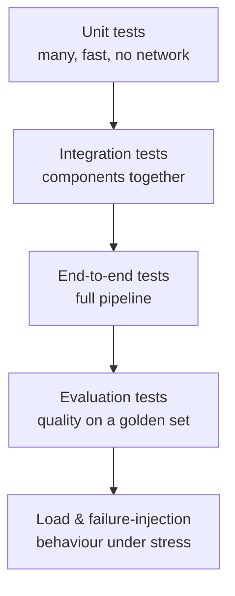

# Chapter 9 — Testing Strategy

Tests are how you make change *safe*. Across the four repositories the philosophy
is the same: fast unit tests on every push, heavier checks gated behind CI, and —
uniquely for AI systems — **evaluation as a test** (Chapters 4–5). This chapter is
the catalogue.

## 9.1 The testing pyramid, adapted for AI systems



Classic software has the top four layers. AI systems add **evaluation tests** —
quality is a *measured property*, not a pass/fail assertion, so it needs its own
layer (the Ragas gate in Chapter 5, the benchmark harness in Chapter 6).

## 9.2 The suites

For each suite: *what* it tests, *why* it matters, *how* to run it, and what
pass looks like.

### Unit tests
- **What / why:** individual pure functions (chunker, RRF fusion, citation
  parsing, metric percentiles) — fast, deterministic, no network.
- **How:** `pytest` (each repo). Example real tests: `prod-rag`
  `test_chunker.py`, `test_citations.py`, `test_metrics.py`; `local-slm-lab`
  `test_prompts.py`, `test_temp_study.py`.
- **Pass:** all green in seconds; a broken invariant (e.g. overlap math) fails
  immediately.

### Integration tests
- **What / why:** components wired together — e.g. hybrid retrieval over a real
  in-memory index, or the Instructor extraction path against a local model.
- **How:** `pytest` with a small fixture corpus/model.
- **Pass:** the pieces produce the expected joined behaviour (retrieve → rerank
  returns on-topic passages).

### End-to-end tests
- **What / why:** the whole pipeline for one input (`answer()` returns a grounded
  answer or a clean abstention).
- **How:** run the pipeline over a fixed question; assert shape (`answer`,
  `citations`, `refused`).
- **Pass:** in-corpus question → grounded answer with citations; out-of-corpus →
  `refused: true`.

### Regression / evaluation tests (the AI-specific one)
- **What / why:** quality must not silently drop. The Ragas gate scores the golden
  set and **fails the build** below threshold (Chapter 5).
- **How:** `python eval/run_ragas.py` locally; automatically on every PR.
- **Pass:** faithfulness ≥ 0.80, answer relevancy ≥ 0.78, context precision ≥
  0.80. A `nan` counts as failure.

### Load tests
- **What / why:** latency under concurrency; find the point where p90 degrades.
- **How:** drive the FastAPI endpoint with a load tool (e.g. `locust`/`k6`) at
  rising concurrency; watch p50/p90 from the metrics rollup.
- **Pass:** latency stays within budget up to the target concurrency; degradation
  is graceful, not a cliff.

### Failure-injection tests
- **What / why:** verify fallbacks (Chapter 8). Break ASR/LLM/TTS/WebSocket and
  confirm the user still gets a useful, timely response.
- **How:** `realtime-voice` injects failures via the mock stages + replay.
- **Pass:** each injected failure yields the *documented* degraded behaviour, not
  a crash or dead air.

### Contract & schema-validation tests
- **What / why:** external I/O keeps its shape. The extraction output must satisfy
  its Pydantic schema; the API response must match its contract.
- **How:** Pydantic validation in code + tests that assert schema conformance.
- **Pass:** malformed output is rejected/retried, never silently accepted.

### Prompt tests
- **What / why:** prompts are versioned code (Chapter 4); a prompt change is
  evaluated, not merged on vibes.
- **How:** the eval gate *is* the prompt test — a prompt edit that lowers
  faithfulness fails CI.
- **Pass:** prompt changes hold or improve the gated metrics.

### Retrieval tests
- **What / why:** the retriever returns the right passages for known queries.
- **How:** assert that a query for a known fact retrieves the chunk containing it.
- **Pass:** the supporting chunk appears in the top-`n`.

### Security tests
- **What / why:** no secret ever lands in git; no known-vulnerable dependency
  ships.
- **How:** `gitleaks detect` + pre-commit (Chapter 3), `pip-audit`/Dependabot.
- **Pass:** gitleaks reports no leaks; audit reports no criticals.

## 9.3 Running everything

```bash
make test                         # unit + integration (each repo)
python eval/run_ragas.py          # evaluation gate (prod-rag)
python -m bench.runner ...        # benchmark (local-slm-lab)
gitleaks detect --source .        # security
pre-commit run --all-files        # hooks (lint + gitleaks)
```

## 9.4 Reading a test summary

> **EXAMPLE — a consolidated status (format; fill with your run).**
> ```
> Suite                Total  Pass  Fail  Skip
> unit + integration       9     9     0     0
> evaluation gate          3     3     0     0     (faithfulness 0.87, ...)
> gitleaks                 -     -     0     -     no leaks
> build status: GREEN
> ```
> Code coverage is reported by `pytest --cov`; the exact percentage is a number
> *you* generate on your machine, so it is left as a slot rather than invented.

## 9.5 Troubleshooting the common failures

| Symptom | Likely cause | Fix |
|---------|-------------|-----|
| `ModuleNotFoundError: rag` | `src` not on path | run with `PYTHONPATH=src` or `pip install -e .` |
| Eval gate `nan` | judge/network error or empty retrieval | check `OPENAI_API_KEY`, ensure indexes were built |
| Ollama tests hang | server not running | start Ollama; `curl localhost:11434/api/tags` |
| gitleaks flags a test fixture | example key in a sample file | move to `.env.example` with an empty value |
| Flaky latency assertions | timing on a busy machine | assert budgets, not exact ms; use percentiles |

Tests give you the confidence to deploy — which is Chapter 10.

### References

- pytest documentation; Ragas; `locust`/`k6` load-testing docs; Nygard,
  "Release It!" (stability testing); OWASP testing guidance; gitleaks & pip-audit.
